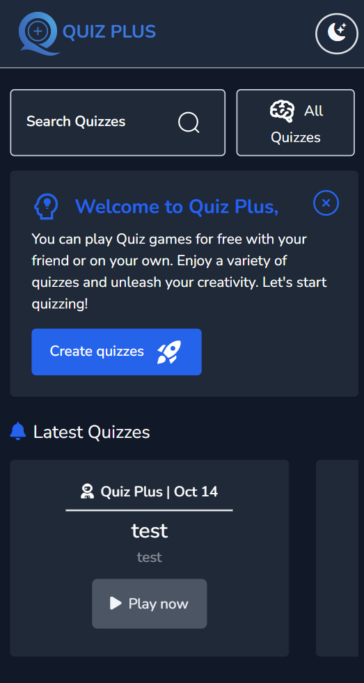
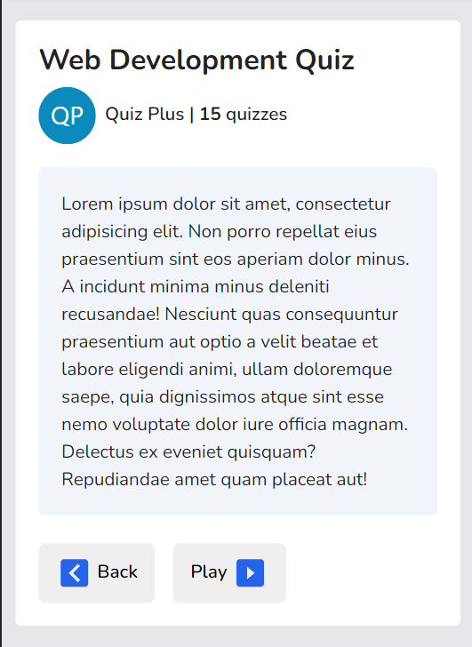
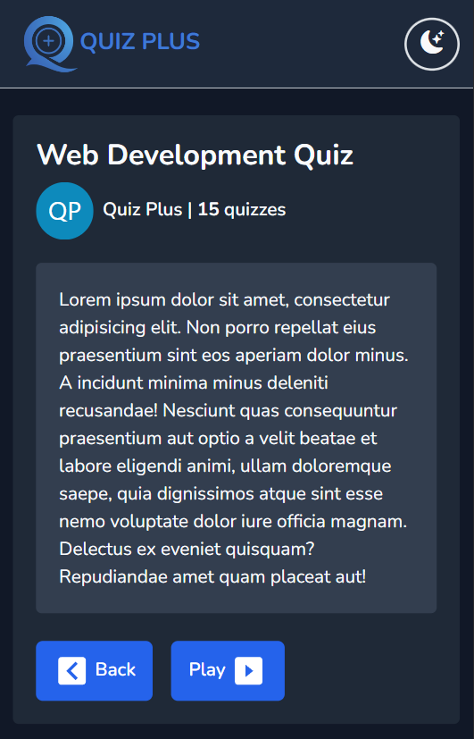
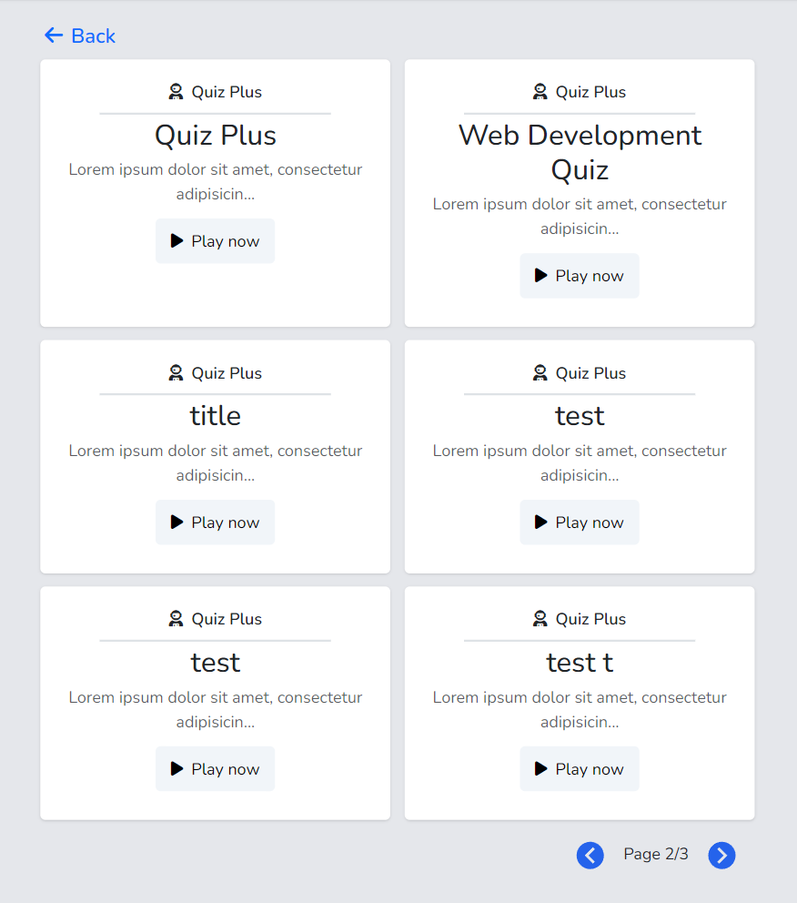
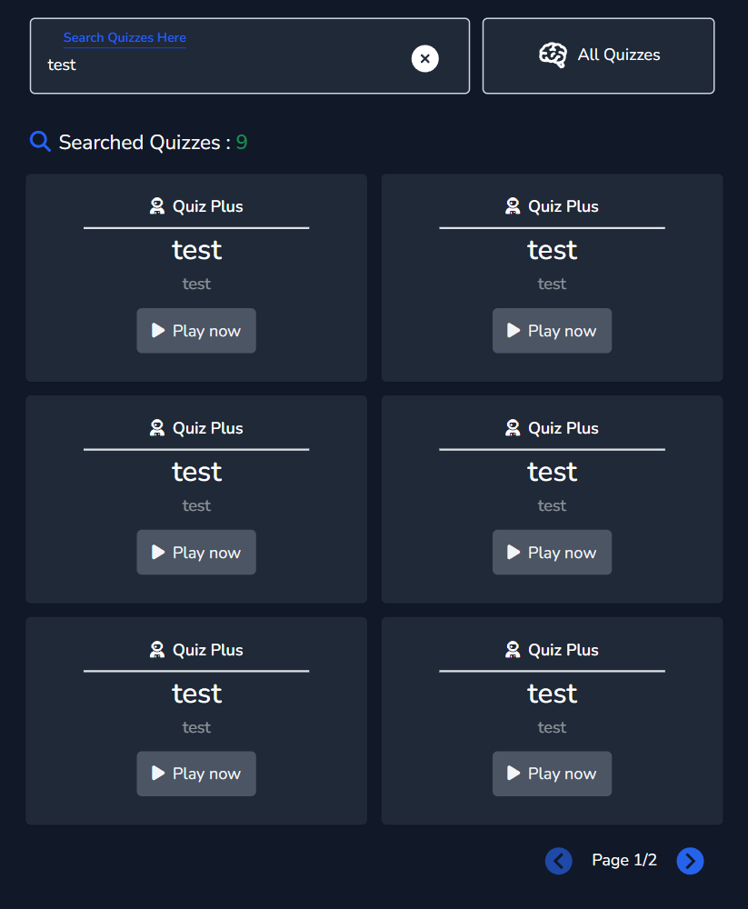
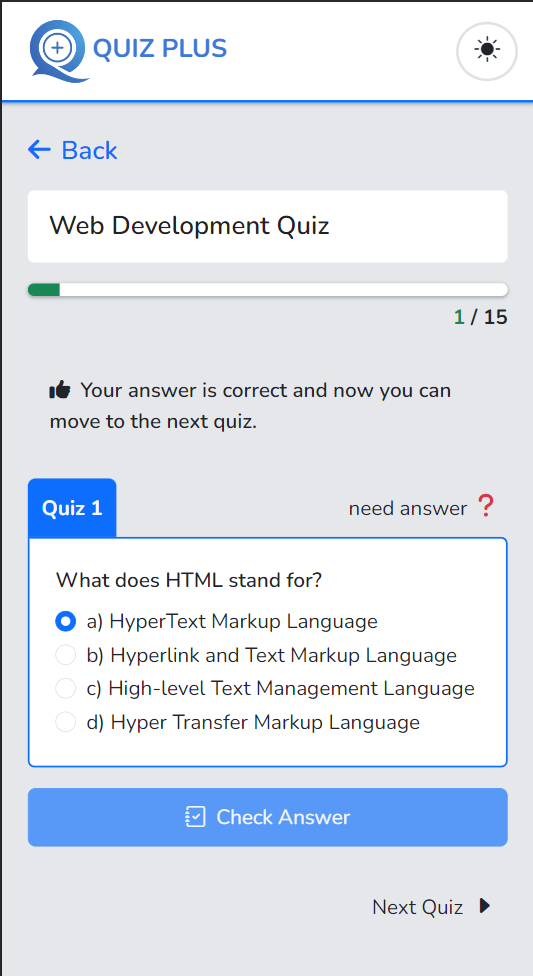
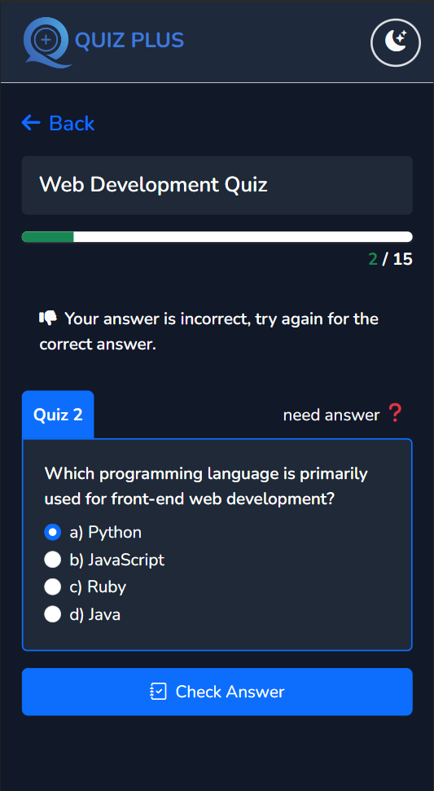

<h1 align='center'>Documentation</h1>
<hr>

# QUIZ PLUS

| Home Page Light              | Home Dark Mobile               |
| ---------------------- | ---------------------- |
|  |  |


<h2>Features</h2>
<ul>
    <li>Home Page</li>
    <li>Search Quizzes</li>
    <li>All Quizzes with pagination</li>
    <li>View Detail of Quiz info</li>
    <li>Play Quiz and Mark System</li>
    <li>Light Mode and Dark Mode</li>
</ul>

| Detail Light              | Detail Dark               |
| ---------------------- | ---------------------- |
|  |  |

<h2>Languages</h2>
<ul>
    <li><b>HTML5</b> - HyperText Markup Language</li>
    <li><b>CSS3</b> - Cascading Style Sheets</li>
    <li><b>JavaScript ES6</b> - Scripting programming language</li>
</ul>

<h2>Frameworks and Libraries</h2>
<ul>
    <li>Vue 3 cli</li>
    <li>VueX</li>
    <li>Bootstrap 5</li>
    <li>Swiper Js</li>
    <li>SweetAlert 2</li>
</ul>

| Home Page Light              | Dark Mobile               |
| ---------------------- | ---------------------- |
|  |  |

<h2>Icon Resources</h2>
<ul>
    <li>Fontawesome Icons</li>
    <li>Bootstrap Icons</li>
    <li>icones.js.org</li>
</ul>

| Home Page Light              | Dark Mobile               |
| ---------------------- | ---------------------- |
|  |  |

<h2>Management Source Code</h2>
<ul>
    <li>Git</li>
    <li>GitHub</li>
</ul>


## Installation

```
    npm run serve
```

*notice : First you need to host the back-end server

[Back-end Github Repo Link Here](https://github.com/sayrgyiwoody/quiz_back-end) !
